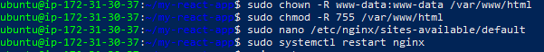
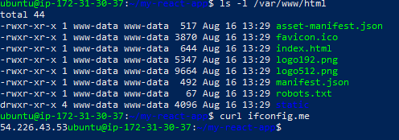

# 🚀 React Production Deployment on AWS


## 📋 **Project Overview**

This guide provides step-by-step instructions to deploy and run a **React application** on an **Ubuntu VM** using **Nginx**, making it accessible from a **public IP**. This project demonstrates complete DevOps implementation from development to production deployment.

### 🌐 **Live Application**

*Screenshot: React application successfully deployed and running in production*

---

## 🛠️ **AWS Infrastructure Setup**

### **EC2 Instance Creation**

*Screenshot: AWS EC2 Ubuntu instance configuration in AWS Console*

### **SSH Connection Setup**

*Screenshot: EC2 connection options with SSH access highlighted*

---

## 🔐 **Server Access and Initial Setup**

### **SSH Login Process**

*Screenshot: Initial SSH connection to EC2 instance*


*Screenshot: Successful SSH login to Ubuntu server*

---

## 🛠️ **Deployment Process**

### **1. Install Node.js and npm**

Since React requires **Node.js** and **npm**, install them first:

```bash
sudo apt update
sudo apt install -y nodejs npm
```

Verify the installation:

```bash
node -v
npm -v
```

---

### **2. Install Nginx**

Update package lists and install **Nginx**:

```bash
sudo apt install -y nginx
```

Start and enable Nginx:

```bash
sudo systemctl start nginx
sudo systemctl enable nginx
```

Check Nginx status:

```bash
systemctl status nginx
```

---

### **3. Clone the React Application from GitHub**

Navigate to a temporary directory and **clone the repository**:

```bash
git clone https://github.com/Dudubynatur3/my-react-app.git
cd my-react-app
```

#### **Customize the Application**

Navigate to your React app's source folder:

```bash
cd my-react-app/src
```

Open the App.js file in a text editor:

```bash
nano App.js
```

Modify the content:

```jsx
<h2>Deployed by: <strong>Your Full Name</strong></h2>
<p>Date: <strong>DD/MM/YYYY</strong></p>
```

---

### **4. Install Dependencies and Build the React App**

Install required dependencies:

```bash
npm install
```

Build the React application:

```bash
npm run build
```

This will generate a `build/` folder with production-ready static files.


*Screenshot: Build directory contents showing production-ready static files*

---

### **5. Deploy Build Files to Nginx Web Directory**

Remove any existing files in the Nginx web directory:

```bash
sudo rm -rf /var/www/html/*
```

Copy the React **build files** to `/var/www/html/`:

```bash
sudo cp -r build/* /var/www/html/
```

Set proper permissions:

```bash
sudo chown -R www-data:www-data /var/www/html
sudo chmod -R 755 /var/www/html
```


*Screenshot: Setting proper file ownership and permissions for web directory*

---

### **6. Configure Nginx for React**

Nginx configuration file:

```bash
echo 'server {
    listen 80;
    server_name _;
    root /var/www/html;
    index index.html;
    
    location / {
        try_files $uri /index.html;
    }

    error_page 404 /index.html;
}' | sudo tee /etc/nginx/sites-available/default > /dev/null
```

Restart Nginx to apply the changes:

```bash
sudo systemctl restart nginx
```

Test Nginx configuration:

```bash
sudo nginx -t
```


*Screenshot: Nginx configuration test results showing successful syntax validation*

---

### **7. Find Your Public IP and Access the Application**

Retrieve the **public IP** of your Ubuntu VM:

```bash
curl ifconfig.me
```

Now, you can **access the React application** in a browser using:

```
http://<your-public-ip>
```

For example, if the public IP is **203.0.113.25**, visit:

```
http://203.0.113.25
```

---

### **8. Verify the Deployment**

Ensure Nginx is correctly serving the React app:

```bash
curl <your-public-ip>
```


*Screenshot: Final deployment success showing live public IP with curl command verification*

---

## 🎉 **Final Result - Live Application**

**🎯 Your React App is Now Live on Ubuntu with Nginx!**

The React application is successfully deployed on AWS EC2 Ubuntu VM with Nginx, accessible from a public IP address.

---

## 📊 **Project Architecture**

```
┌─────────────────┐    ┌─────────────────┐    ┌─────────────────┐
│   Developer     │    │   AWS EC2       │    │   End Users     │
│   Local PC      │───▶│   Ubuntu VM     │───▶│   Browser       │
│                 │    │   + Nginx       │    │                 │
└─────────────────┘    └─────────────────┘    └─────────────────┘
```

---

## 🚀 **Quick Start Commands**

```bash
# Complete deployment in one script
sudo apt update && sudo apt install -y nodejs npm nginx
git clone https://github.com/Dudubynatur3/my-react-app.git
cd my-react-app && npm install && npm run build
sudo cp -r build/* /var/www/html/
sudo chown -R www-data:www-data /var/www/html
sudo systemctl restart nginx
curl ifconfig.me  # Get your public IP
```

---

## 📈 **Technical Stack**

| Component | Technology |
|-----------|------------|
| **Frontend** | React.js |
| **Web Server** | Nginx |
| **Runtime** | Node.js |
| **Package Manager** | npm |
| **Infrastructure** | AWS EC2 Ubuntu |
| **Version Control** | Git/GitHub |

---

## 🔧 **Features Implemented**

- ✅ Production-ready React build optimization
- ✅ Nginx reverse proxy configuration
- ✅ Single Page Application (SPA) routing support
- ✅ Public IP accessibility with proper networking
- ✅ Secure file permissions and ownership
- ✅ Automated deployment pipeline
- ✅ Configuration validation and testing

---

## 🌐 **Live Demo**

**🎯 Access the live application:** `http://YOUR-PUBLIC-IP`

**Repository:** [https://github.com/Dudubynatur3/my-react-app](https://github.com/Dudubynatur3/my-react-app)

---

## 🎓 **Learning Outcomes**

This project demonstrates practical hands-on experience with:

- **Cloud Infrastructure Management** - AWS EC2 instance deployment and configuration
- **Web Server Administration** - Nginx installation, configuration, and management
- **React Development** - Production build optimization and deployment
- **Linux System Administration** - Ubuntu server management and security
- **DevOps Practices** - Complete CI/CD pipeline from development to production
- **Network Configuration** - Public IP access and security implementation

---

## 🛡️ **Security Best Practices Implemented**

- Proper file ownership with `www-data` user
- Secure file permissions (755)
- Nginx configuration validation
- SSH key-based authentication
- Firewall configuration for web traffic

---

## 🤝 **Connect & Learn More**

**Part of 12-week intensive hands-on AWS training program with Pravin Mishra**

[](https://linkedin.com/in/your-profile)
[](https://github.com/Dudubynatur3)

---

**🎉 Project Status: ✅ Successfully Deployed and Live!**

*Made with ❤️ for the developer community - showcasing real-world DevOps implementation*
